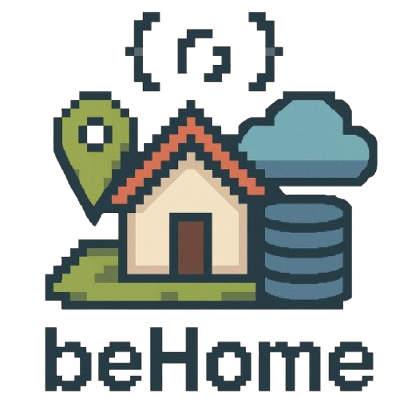
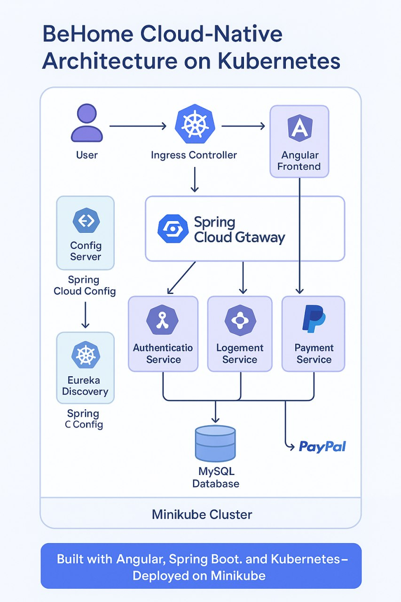

# Ter Behome 


**Ter Behome** est une plateforme de réservation de biens immobiliers, où chaque **propriétaire** peut publier son logement et chaque **locataire** peut effectuer une réservation en toute simplicité.

<p align="center">
  
</p>

## 🏗️ Description

Ce projet a été réalisé dans le cadre du projet de fin d'année universitaire 2024/2025. Il propose une solution complète pour la mise en relation entre propriétaires et locataires, avec gestion des annonces, réservations, et interactions entre utilisateurs.

## 🚀 Technologies utilisées

- ⚙️ **Backend** : Architecture **microservices** avec **Spring Boot**
- 🖥️ **Frontend** : Application web développée avec **Angular**
- ☁️ **Déploiement** : Environnement **Kubernetes** avec **Nginx Ingress Controller**

## 🧩 Architecture

L'architecture de **Ter Behome** repose sur une approche cloud-native avec Spring Cloud pour la gestion des microservices, un frontend Angular, et un déploiement complet sur Kubernetes via Minikube. Le routage est géré par un Ingress Controller, et les services sont orchestrés autour de Spring Cloud Gateway, Eureka Discovery, et Config Server.

<p align="center">
  
</p>

## 📦 Structure du projet
<pre> 
   /Manifest Kubernetes/ -> Fichiers YAML de déploiement Kubernetes 
   /logebien_front/ -> Application Angular 
   /microservice/ -> Code des microservices Spring Boot</pre>

## 📋 Prérequis

- `kubectl` installé et configuré
- Cluster Kubernetes opérationnel (Minikube)
- Ingress Nginx installé sur le cluster
## 🛠️ Lancement du projet

### 🔧 1. Installation et configuration de Minikube (si ce n’est pas déjà fait)

- Installer Minikube : [Guide officiel](https://minikube.sigs.k8s.io/docs/start/)
- Démarrer le cluster :
  ```bash
  minikube start --driver=docker
- Activer l’Ingress Controller :
  ``bash
  minikube addons enable ingress
